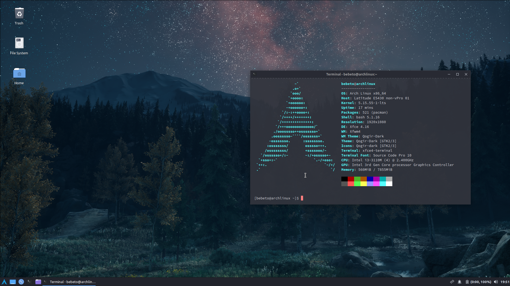

# Minimal XFCE4 Theming

This customization was designed for Arch Linux but can be easily adapted to any distribution.
Some packages are required to install successfully, for that see the `xfce4-packages` file.


## How To Install

```bash
# Clone this repository.
$ git clone https://github.com/bebetoalves/minimal-xfce4-theming

# Enter the directory.
$ cd minimal-xfce4-theming

# Run install script.
$ ./install.sh
```

After installation, reboot your system.

## Resources

- [Arch Install](https://github.com/archlinux/archinstall)
- [Qogir GTK Theme](https://github.com/vinceliuice/Qogir-theme)
- [Qogir Icon Theme](https://github.com/vinceliuice/Qogir-icon-theme)

## License

[MIT](https://choosealicense.com/licenses/mit/)